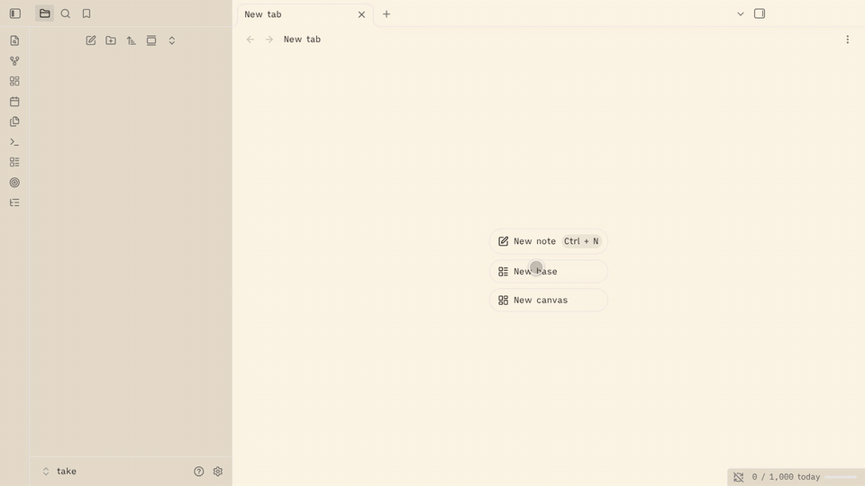
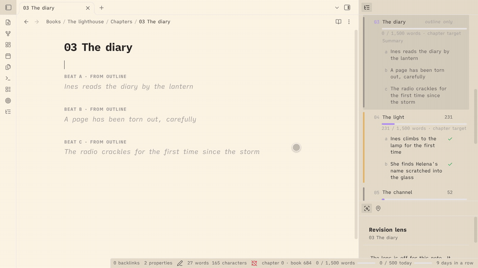
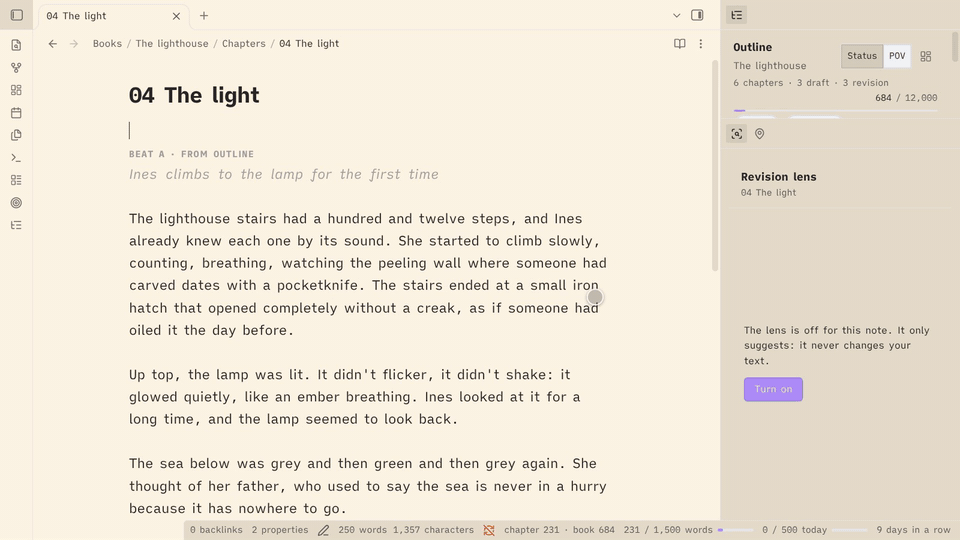
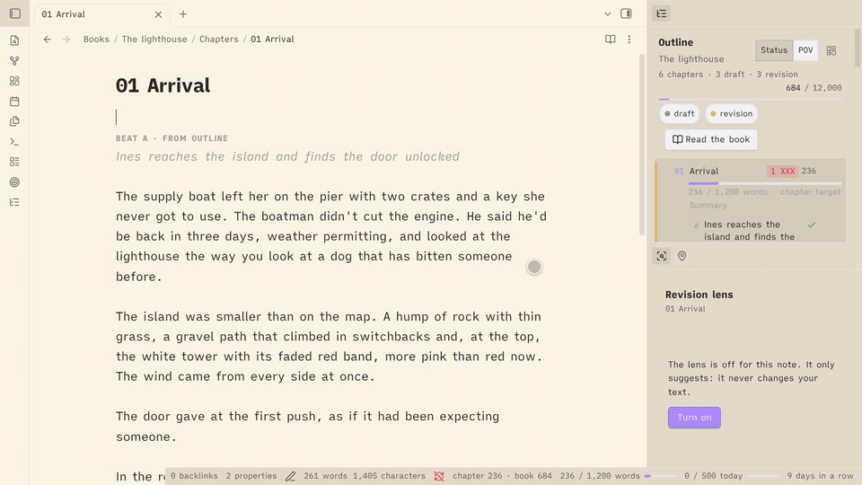

<p align="center">
  <picture>
    <source media="(prefers-color-scheme: dark)" srcset="docs/images/banner-dark.png">
    
  </picture>
</p>

<p align="center">
  <a href="https://github.com/ClaudioDavi/escrita/releases/latest"></a>
  
  
  
  <a href="LICENSE"></a>
</p>

<p align="center">
  <a href="#install">Install</a> ·
  <a href="docs/guide/en/getting-started.md">Getting started</a> ·
  <a href="docs/guide/pt-BR/getting-started.md">Comece aqui (português)</a> ·
  <a href="#what-escrita-does">Features</a> ·
  <a href="#changelog">Changelog</a>
</p>

An Obsidian plugin for fiction writers: an outline that lives inside your chapters, word goals and sprints, placeholders, a safe place for the passages you cut, a revision lens, manuscript export, and a shared universe of characters and places.

Your books stay plain Markdown. Everything Escrita adds to a chapter is an Obsidian comment (`%% … %%`), so it is hidden in Reading view and by most publishing tools. Escrita never contacts a server or a model, and it never changes your prose unless you click.

Escrita is inspired by [NEO](https://github.com/hughhowey/neo) by Hugh Howey (MIT License). Parts of its design and logic are adapted from NEO. Escrita is not affiliated with NEO or its author.

## Install

It needs Obsidian **1.8.7 or later**. It works on desktop and on phones.

- **Community plugins** (once Escrita is listed): open Settings → Community plugins → Browse, search for "Escrita", then install and enable it.
- **With BRAT**: install the [BRAT](https://github.com/TfTHacker/obsidian42-brat) plugin, choose "Add a beta plugin", and enter `ClaudioDavi/escrita`.
- **Manually**: download `main.js`, `manifest.json` and `styles.css` from the latest [release](https://github.com/ClaudioDavi/escrita/releases), put them in `<your vault>/.obsidian/plugins/escrita/`, reload Obsidian, and enable Escrita in Settings → Community plugins.

## Getting started

1. Enable Escrita. A notice offers to set the vault up; you can also run **Set up a writing vault** from the command palette.
2. The setup shows everything before it creates anything. Pick a starting point (Essentials, Writer or Everything), a layout, and the folders and examples you want.
3. Open the example conto or book, or run **Create a book**, and write. Escrita sets no hotkeys; bind the commands you use in Settings → Hotkeys.

Step by step: [Getting started](docs/guide/en/getting-started.md) ([Português](docs/guide/pt-BR/getting-started.md)).



## What Escrita does

Each part is a switch on the Features page, so you can turn off what you don't use. Every command and setting is described in the guide for its group. The guides are in English and in Brazilian Portuguese.

**Features and settings.** The Features page turns each part on or off. It has three starting points (Essentials, Writer, Everything), and a fresh install takes its defaults (status words, folder names) from Obsidian's language. A feature that is off isn't loaded, and its data stays. Guide: [English](docs/guide/en/features-and-settings.md) · [Português](docs/guide/pt-BR/features-and-settings.md).

**Writing.** The outline sits in the sidebar and lists your chapters and their beats, with point of view, filters, a board and a "Read the book" view. Goals, pacing, sprints, days off, targets for a single conto or essay, placeholders, Enter flow, smart typography, dialogue focus, moving a paragraph or scene, templates, spellcheck on demand and word counts in the file explorer are here too. Guide: [English](docs/guide/en/writing.md) · [Português](docs/guide/pt-BR/writing.md).



**Tracking.** Works move through five stages (idea, draft, revision, ready, published), mapped to your own status words. The home note shows what to write today and opens each work where you left off. Writing mode strips the screen down to the note. A snapshot is taken at each stage change. Guide: [English](docs/guide/en/tracking.md) · [Português](docs/guide/pt-BR/tracking.md).

**Revision.** The revision lens underlines what is worth rereading (echoes, adverbs, gerunds, crutch words, name variants, long sentences) and never changes your text. Snapshots keep named and automatic copies of a note that you can compare word by word and restore. Darlings keep the passages you cut, restorable to where they came from. Guide: [English](docs/guide/en/revision.md) · [Português](docs/guide/pt-BR/revision.md).



**Publishing.** The publish check looks for open comments, placeholders and unwritten beats before you mark a note published. Export writes Markdown, DOCX or EPUB (Shunn and pt-BR templates), for a note, a book or a collection of contos. Submissions record where a work was sent and what came back. Guide: [English](docs/guide/en/publishing.md) · [Português](docs/guide/pt-BR/publishing.md).



**The world.** A shared universe of characters, places, objects, groups and events, with "Appears in", unlinked mentions, names in the editor and the revision lens, and open threads you plant in one story for a later one. Guide: [English](docs/guide/en/the-world.md) · [Português](docs/guide/pt-BR/the-world.md).

## Privacy

No network access, no AI, no telemetry. Escrita never contacts a server or a model, and a test fails if network code ever appears in its source or in the built plugin. Your writing stays in your vault. Word history, settings and what Escrita remembers about published notes are saved in the plugin's `data.json` inside your vault's `.obsidian/plugins/escrita/` folder.

## Languages

Escrita follows Obsidian's language setting. It ships in:

- English
- Português (Brasil)

To add a language, add a key for it (for example `es` or `fr`) with translated strings to `src/strings.ts` and to each `src/*/strings.ts`. English is the source of truth. Missing strings fall back to English. Pull requests are welcome.

## Development

```
npm install
npm run dev      # bundle styles.css once, then rebuild main.js on every change
npm run build    # type check, bundle styles.css and make a production main.js
npm test         # unit tests
```

To try your build, link or copy the repository folder into a test vault's `.obsidian/plugins/escrita/`.

To release, run `npm version <patch|minor|major> --no-git-tag-version` (it updates `manifest.json` and `versions.json`), commit, then push a tag with the bare version number (for example `git tag 0.1.1 && git push --tags`). The release workflow builds the plugin and drafts a GitHub release with `main.js`, `manifest.json` and `styles.css`; publish the draft when it looks right.

## Changelog

### 1.0.0 (2026-10-09)

The full release. Everything from 0.9 is still here; 1.0 adds a way in and finishes the guides.

- **Set up a writing vault**: a first-run notice and a command that show everything before they create anything. You choose the starting point, the layout, the folders and the examples. It never overwrites or moves a note.
- **Presets**: **Essentials**, **Writer** and **Everything** on the Features page set the switches at once, after a step that lists what will change. A fresh install starts with Writer.
- **Writing mode**: write with only the note on screen. See [Tracking](docs/guide/en/tracking.md).
- **Defaults in your language**: a fresh install takes its status words, folder names and examples from Obsidian's language (any Portuguese gives Portuguese, anything else gives English). They are saved once and never change after that.
- **The effective piece**: a chapter that takes its book's `chapterTarget` now shows the same target everywhere: the outline, the file explorer and the status bar. Before, the outline showed it and the others did not.
- **Mobile pass**: the views, modals and menus were checked at phone width, with touch targets of at least 32 px and no hover-only control. A regex lookbehind that stopped Escrita from loading on older iPhones (Safari before 16.4) is gone, and a test keeps it out.
- **Universe "⋯" button**: each entry row in the universe panel has a visible more button for its actions, so a phone or tablet doesn't need a right-click.
- **Guides complete**: all seven pages, in English and Brazilian Portuguese: [Getting started](docs/guide/en/getting-started.md), [Features and settings](docs/guide/en/features-and-settings.md), [Writing](docs/guide/en/writing.md), [Tracking](docs/guide/en/tracking.md), [Revision](docs/guide/en/revision.md), [Publishing](docs/guide/en/publishing.md) and [The world](docs/guide/en/the-world.md). Every command and setting appears in a guide, and this README is now the front door to them.
- Upgrade notes:
  - Escrita now needs Obsidian 1.8.7 or later (`minAppVersion`).
  - Your existing settings are unchanged, and the setup notice does not show on an update. An existing install keeps the English defaults it was using, even when Obsidian runs in Portuguese, so no folder or status word changes under you.
  - Every feature stays as it was, and every switch keeps its state.
- **Threads in Portuguese**: a new Portuguese install marks threads as `%% thread: … %%` and `%% thread fechada: … %%`, and the interface says "thread". An install that already saved `fio` keeps it.
- Fixes before release: clearing a setting restores the default in your install's language, not English (a cleared closed word in Portuguese stays `fechada`); the setup and **Open the home note** find the same home note and adopt an existing one instead of creating a second; the darlings note is written through the editor when it is open, so undo works; dialogue focus and the name marks no longer stop after one failed redraw. From the demo rehearsal: the setup's rows no longer overlap, it creates the universe note for a shared world, ticks the layout in a new vault and gives each row an honest reason; the home note opens in the main area on startup, not in a side panel; Escape on a beat you just made in the outline takes it back out; a new universe entry opens in a tab, not a split; "Appears in" shows counting until a new entry is counted; the EPUB byline uses the full name and its preview lists the contents once; the Compare view and the lens panel show their titles whole; and the progress window opened for a book or piece no longer reads the daily goal against that work's words.
- Internal: shared helpers moved out of module folders (`core/` and `ui/`), and the Obsidian guidelines lint (`eslint-plugin-obsidianmd`) runs in CI.

### 0.9.0

- **Unlinked mentions**: the universe panel lists the places in the note you are in where an entry is named without a link. **Create link** turns that one mention into a link, on your click, and writes nothing else. See [The world](docs/guide/en/the-world.md#11-unlinked-mentions).
- **Names without an entry**: a new revision lens rule, off until you turn it on, marks capitalized names that recur (5 times in the note, or in 2 works) and match no entry. **Create** opens the new-entry dialog with the name filled in; **Dismiss** adds the word to the **Not names** setting. See [The world](docs/guide/en/the-world.md#names-without-an-entry).
- **EPUB export**: **Export…** now offers EPUB 3 beside Markdown and DOCX, with a title page, a table of contents, one file per chapter, an ornamental scene break (a setting) and an optional cover from a `cover` property. See [Publishing](docs/guide/en/publishing.md#export-an-epub).
- **Collections**: select several contos in the file explorer, right-click, **Create a collection…**. The note lists the stories in a `contents` property and exports as one DOCX, EPUB or Markdown file. See [Publishing](docs/guide/en/publishing.md#export-a-collection-of-stories).
- **Publish next chapter**: for a book released one chapter at a time, the command and an outline button open the first unpublished chapter's publish check; the outline header shows the next chapter, the last published and any gap, and the check warns when an earlier chapter isn't published. See [Publishing](docs/guide/en/publishing.md#publish-a-book-one-chapter-at-a-time).
- **Read the book**: a read-only view of every chapter in order, with the export's chapter headings and scene breaks and your markers hidden. Click a paragraph to open that chapter at that line; it remembers where you stopped. See [Writing](docs/guide/en/writing.md#read-the-book).
- **Settings**: Not names, the cover property, the EPUB scene break and the collection property. See [Features and settings](docs/guide/en/features-and-settings.md#settings-added-in-09).
- Upgrade notes:
  - The revision lens runs one new pass after the update. Nothing is marked by the new names rule until you turn it on.
- Internal: scope is a field of the classifier (`books.classify(x).scope`) and `core/scope.ts` holds the rule; the names port answers the lens's names rule; the EPUB writer is checked with EPUBCheck in CI.

### 0.8.0

- **Export**: **Export…** turns the active note, or its whole book, into a manuscript file: Markdown or DOCX, in the Shunn (Letter, English) or pt-BR (A4, Portuguese labels) template. A preview shows the manuscript before the file is written, readiness warnings link to their lines, and **Export again** repeats the last export in one click. Files go to the export folder (default `Escrita/Exports`). See [Publishing](docs/guide/en/publishing.md#export-a-note-or-a-book).
- **Chapters without a number**: a chapter numbered `00` is a prologue (first, its title alone, not counted), and the new **Chapters without a number** setting lists titles (such as an epilogue) that also export with their title alone. See [Publishing](docs/guide/en/publishing.md#export-a-note-or-a-book).
- **Author and contact**: settings for your name, surname and contact lines, used on the title page and in the header. An `author` property on a book or a note overrides the name.
- **Submissions**: **Record a submission** makes one note per submission in the submissions folder (default `Escrita/Submissions`), with the work, the market, the date and the result. The home block shows how many are pending. See [Publishing](docs/guide/en/publishing.md#record-a-submission).
- **Settings**: each feature now draws its own section, in the same order as before, and a text field saves when you leave it instead of on every key. Export and submissions are two new switches on the Features page, which now has 19.
- **Performance**: index passes now yield every 8 ms, so Obsidian stays responsive while a large vault is read. "Appears in" builds on demand, when you first open it, so startup index work on a 3,000-note vault drops from about 4.2 s to under 0.1 s, and typing in a long chapter no longer recomputes mentions. Name matching and the revision lens are faster.
- **Fix**: only a `<!--` at the start of a line that is never closed hides the rest of the note from counts and the publish check, and the publish check warns about it. A `%%` inside `$$` math is literal, as in Reading view.
- Upgrade notes:
  - Notes in the export folder (`Escrita/Exports`) and the submissions folder (`Escrita/Submissions`) never count toward goals and never become works.
  - In the Editor section of the settings, the paragraph style and quote style rows now come after the typing rows.
  - There are 19 feature switches, up from 17.
- Internal: a manuscript model and book source in core, readiness checks shared by publish and export, `notes.create` for new notes (including binary files), one name fold, and time-budgeted index passes.

### 0.7.0

- **Features page**: a switch for each of 17 features, in five groups, at the top of the settings. An off feature is not loaded, its settings hide and its data stays. See [Features and settings](docs/guide/en/features-and-settings.md).
- **Keep a note out of the universe**: `universe: false` on a note, or on a book note for the whole book. See [The world](docs/guide/en/the-world.md#keeping-one-note-out-universe-false).
- **Appears in**: where each entry is mentioned, in the panel's Entries tab and in a section at the end of each entry note, with counts. See [The world](docs/guide/en/the-world.md#9-appears-in-where-a-character-or-place-is-mentioned).
- **Names in spellcheck and the revision lens**: entry names are not flagged as typos, an optional underline shows them, and the lens reads them. See [The world](docs/guide/en/the-world.md#10-names-in-the-editor-and-the-revision-lens).
- **POV and status in the outline**: colored stripes, a Status/POV toggle, stage and POV chips, and a summary by stage. See [Writing](docs/guide/en/writing.md).
- **Per-chapter targets**: a bar per chapter, and `chapterTarget` on the book note as the default. See [Writing](docs/guide/en/writing.md#a-target-for-every-chapter).
- **User guide**: `docs/guide/` in English and Brazilian Portuguese; the universe guide moved there as "The world".
- The minimum Obsidian version is now 1.7.2.
- **Writing language** moved out of Revision to the Features page, with the same key.
- Word counts in the explorer, spellcheck on demand and the universe mode moved to the Features page as switches.
- The piece property names and the track folders moved to a section called "Properties and folders".
- Drag and renumbering in the outline pause while it is filtered, and Tab no longer turns a chapter (or a new line) into a beat of a chapter the filter hides.
- New books and chapters, and notes you create in a tracked folder, start in the draft stage: they get your first draft status word unless they (or their template) already have a status. Templates, universe entries and Escrita's own notes are left alone. Turn it off in Settings → Stages, "New notes start as draft". In "Appears in", a book counts as a work even before its note has a status.
- A feature turned off keeps its ribbon icon until you restart Obsidian (a click says the feature is off), and on a phone a command pinned to the mobile toolbar keeps a dead button until you restart.
- Internal: modules now load and unload at runtime, and the outline reads each chapter through one row loader.

### 0.6.0

- **Shared universe** (off by default): characters, places, objects, groups and events that your stories share. Three modes: off, per book (entries inside each book) and universe (entries in the folder beside a universe note). A work joins with a `universe` property, through its book, or by sitting in one of the folders you list. Five entry types, renamable, each with its folder, template and name in menus. Changing the mode never moves or edits notes. A walkthrough is in [the universe guide](docs/guide/en/the-world.md).
- **Universe panel**: **Entries** (grouped by type, searchable by name and alias ignoring accents, with open, insert link and show in explorer), **Threads** and **Works** (grouped by form, by stage and name, with stage dots and word counts; a click opens where you left off). An **Add to** button joins the note you're in to the universe, only when you click it. A picker appears when there is more than one universe.
- **Create universe entry**: from a selection in the editor menu, the command or the panel. It makes the note from the type's template with `type` and `universe` set, can link the selected text (one undo) and add an alias, and offers to open an entry that already has that name or alias. It never overwrites a note.
- **Move this book's entries to the universe**: moves a book's `Characters/`, `Places/`… notes into the universe after a preview, with links updated. Names that already exist are listed and left in place, chapters are never moved, and two boxes add a missing `type` and the book's `universe` property.
- **Forms**: a `form` property (short story, essay, novella, novel, poem, fragment; the words are settings), and **Form by folder** so works take their form from their folder (`Short stories: short story`) without the property.
- **Open threads**: `%% thread: … %%` marks a loose end for a later story. **Plant a thread** inserts one at the cursor, the editor flags it in the margin, and the panel (or **Show open threads** when the universe is off) lists them by work with the date each was first seen. Close one with an optional answer (`%% thread closed: … → [[The House]] %%`) and reopen it; both only write if the marker is unchanged. The thread word and the closed word are settings.
- **Insert from a template**: a **Templates folder** setting and a command that inserts a template at the cursor, fills `{{title}}`, `{{date}}` and `{{time}}`, adds only the properties the note lacks, and undoes in one step.
- Internal: the outline's beat edits now go through the shared note text port, so a chapter open in an editor is edited there and the change joins its undo history.

### 0.5.1

- **Fix**: the revision lens could keep showing marks from before you edited the word lists note (a name you had just added still underlined as a name variant until you turned the lens off and on). Marks now follow the lists as soon as the note changes, and a failed refresh no longer stops an editor from updating.
- **Add to the word lists from the editor menu**: with the lens on, the context menu offers **Add to crutch words**, **Add to names** (for a capitalized word or name) and **Always ignore** (for a single word). It uses your selection (one line, 1 to 6 words) or the word under the cursor, and writes one line under the matching heading of the word lists note. A word already there is not added twice ("Already in the list"). If the note is missing, a starter note is created; if the setting was empty, it is filled in. The rest of the lists note is not touched.

### 0.5.0

- **Revision lens**: **Toggle revision lens** underlines what is worth rereading in the active note and opens a panel. Six rules: echoes, adverbs, gerunds (in English, "started to"), crutch words, name variants and long sentences, each with its own underline and its own switch in the settings. It only suggests and never changes your text. Portuguese (Brasil) and English; in another Obsidian language the panel offers **Open settings** to choose one.
- **Panel measures**: dialogue share (and each scene's share), readability (words per sentence, syllables per word and a reading-ease score with its band: Flesch adapted to Portuguese, or Flesch for English), and each rule's count per 1,000 words. They describe the text and don't grade it.
- **Stepping**: previous and next buttons for each rule ("3 / 12"), and the commands **Next revision lens match** and **Previous revision lens match** for the rule you stepped last. On a phone the drawer closes after a step and a short notice shows where you are.
- **Ignore here**: drop a match you disagree with from the editor's context menu or the panel. It is remembered by the note, the rule, the word and the words around it, follows renames, and the panel's "N ignored · Clear" brings the matches back.
- **Word lists note**: a note you choose in the settings with `## Vícios` / `## Crutch words`, `## Nomes` / `## Names` and `## Ignorar` / `## Ignore`. **Create the word lists note** makes one with a short starter list and never touches an existing note.
- **Revision settings**: language, word lists note, echo window, long sentence length, **Skip quotes**, a toggle per rule, and **Show dialogue share** and **Show readability**.
- **Stemmers**: small Portuguese and English stemmers (`core/stem/`) that group *olhar / olhou / olhando* and keep *casa* and *casamento* apart. Internal for now; the universe will use them later for matching names.
- **Editor loose ends**: the old editor helpers are gone and the editor reads the Markdown segmenter everywhere. Two behaviour changes follow.
  - A `---` inside a code block or a comment no longer counts as a scene break next to a beat in the outline.
  - Removing a trailing scene break in a note that is closed keeps the note's own line endings.

### 0.4.0

- **Stages**: a work moves through five stages (idea, draft, revision, ready, published), each mapped to the status words you already use. New **Stages** settings with a color for each. Your published and unpublished values and status colors carry over the first time you open 0.4: the old settings stay in `data.json`, and an edit to them made after upgrading (for example in 0.3.x) is ignored. Status words are matched ignoring case, and an accent typed as a combining mark still matches. Any of your published words now counts as published, not only the first. Publishing writes the first word of the published stage, and unpublishing restores the earlier status.
- **Stage snapshot**: when a work's status changes to another stage, Escrita takes a snapshot of it ("Draft → Revision"). Stage snapshots are never trimmed.
- **Home block**: an `escrita-works` code block in a note you own lists what you are writing and revising, and counts the rest. A click opens the work where you left off. New **Open the home note** command and an **Open on startup** setting.
- **Where you left off**: Escrita remembers the last place you edited in each work (and in a book's chapters), and the home block opens there. It follows renames.
- **Move a paragraph or scene**: **Move paragraph up/down** and **Move scene up/down**, in one undo step.
- Internal: a reusable vault index (`core/vault-index`) that follows renames, deletes and edits, now behind placeholders, publish records, dialogue focus, goals history, the works list, where you left off and the home note path. The measurer, the explorer and the snapshots store still keep their own path-keyed state.

### 0.3.1

- **Brazilian Portuguese wording**: snapshots are now "versões" ("Salvar uma versão") instead of the European "instantâneos". Delete actions say "Excluir" everywhere, and a few other strings read more naturally.

### 0.3.0

- **Snapshots**: take named snapshots of a note, automatic ones before publishing, before restoring and (optionally) before the day's first edit; a panel to view, compare, restore, rename and delete them; a compare tab with inline, side-by-side and full-text views and **Use the old version** for one passage. Stored as `.txt` files in `Escrita/Snapshots` (see the note on Obsidian Sync above). Known limits: a note created at a deleted note's path inherits that note's snapshots; two notes whose names differ only in special spaces or accents can't both have snapshots (Escrita says so instead of mixing them).
- **Dialogue focus**: dims everything but speech in the editor.
- **Word counts in the file explorer**, in each note's unit, with book totals and optional folder totals and targets. The placeholder dot is now drawn the same way.
- **Settings for the goal and deadline property names** of books and notes.
- **Counting fixes**: one counter for the status bar, outline, progress window, explorer and publish check. The outline reads a book goal of `"80.000"` as 80,000 (it showed 80), a goal of `"80.5"` now reads as 81 (it was 805), and `"1.000,5"` is ignored. Deadlines must be real dates (`2026-02-31` is ignored), and a YAML date no longer shifts a day in time zones west of UTC. A note with only `unit: characters` is counted in characters. "1 word", not "1 words".
- Bundles [jsdiff](https://github.com/kpdecker/jsdiff) (BSD-3-Clause) for comparing snapshots: see [THIRD_PARTY_NOTICES.md](THIRD_PARTY_NOTICES.md).
- Internal: one measure module (`core/measure`) for counts, targets and goals, one file explorer decoration adapter (`core/explorer-decorations`), and one way to edit a note's text through the editor or the vault (`core/note-text`).

### 0.2.1

- **Standalone**: Escrita no longer assumes you publish to a website. Removed the "URL taken" and "URL changed" checks, the offer to keep a URL when renaming a published note, and the publish folders, slug property and keep-URL settings. Saved values for them are ignored. Publishing still checks the note and sets its status and date.
- **Beats and placeholders**: a `%% beat %%` or `%% XXX %%` inside a code block, the properties or another comment no longer counts anywhere (outline, ghost beats, placeholder dots and pills, publish check). Before, the editor and the publish check disagreed. Each beat or placeholder must be alone in its own `%% … %%` on its line.
- **Word counts**: the note, the selection and the publish check now read code blocks, comments and properties the same way. A selection's count no longer includes code or properties, and a code block indented with a tab is no longer treated as code.
- **Books with a nested chapters folder** (such as `Drafts/Chapters`) are now found by every feature, not only some of them.
- Internal: one Markdown segmenter (`core/markdown`) and one file classifier (`core/classify`) replace the copies each module kept; about 200 new tests.

### 0.2.0

- **Publish check**: **Publish this note** and **Unpublish this note**, with checks for unclosed comments, placeholders, unwritten beats, an empty body, recommended properties, the piece's limit, and taken or changed URLs. Offers to keep a published note's URL when you rename it. New **Publishing** settings.
- **Targets per piece**: `target`, `limit`, `unit` and `deadline` on any note, counted in words or characters (with or without spaces). The status bar and the progress window show the piece's length and pacing.
- **Days off**: weekdays and dates off that never break your streak and are skipped when pacing toward a deadline.
- **Outline for a single note**: the outline panel shows and edits the beats of a note outside a book.
- **Enter, Enter, Enter in any tracked note**: scene breaks in short stories and essays too, not only in chapters.
- **No network**: a test fails if network code appears in the source or the built plugin.

### 0.1

- First release: outline and ghost beats, goals and pacing, sprints, status bar, placeholders, darlings, Enter Enter Enter, smart typography, spellcheck on demand.

## License

[MIT](LICENSE). Includes work adapted from [NEO](https://github.com/hughhowey/neo), Copyright (c) 2026 Hugh Howey, MIT License.
